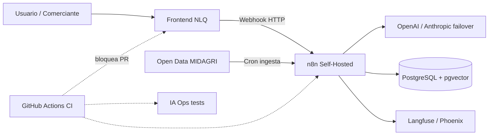

# AgroSmart Insights - Optimización de Mercados y Precios Agrícolas (Caso 2)

## Propósito
Microfrontend NLQ + n8n Self-Hosted + PostgreSQL/pgvector + multi-modelo IA, con canal DevSecOps que bloquea merges inseguros.

## Arquitectura (Sprint 0)



## Estructura del repositorio

```
.github/
  PULL_REQUEST_TEMPLATE.md
  workflows/
    frontend-ci.yml          # validate-frontend
    n8n-validate-ci.yml      # Auditar JSONs de n8n
    ai-testing-ci.yml        # Pruebas Unitarias de IA
src/
  frontend/                  # Microfrontend NLQ
  n8n-workflows/             # JSON exportados de n8n
    production/
    templates/
  database/
    migrations/              # DDL (montado en Docker)
    seeders/
  ia-ops/
    prompts/
    tests/
    config-observability/
    nlq_security.py
infrastructure/
  docker-compose.yml
  .env.example
```

## Roles de la célula

| Rol | Integrante | Responsabilidad clave |
|---|---|---|
| Líder DevSecOps | Gabriel León | Branch protection, CI, secrets, estructura segura |
| Backend / IA | Fiorella Camayoc | Flujos n8n + multi-modelo |
| Frontend | Cindy Huanca | Microfrontend NLQ |
| QA / Prompt Eng | Sebastián Borda | Prompts + pruebas de inyección |
| Arquitecto | Cristhian Pimentel | Arquitectura, ADRs, aprobación de PRs |
| Scrum Master | Jesús De la Cruz | GitHub Projects + trazabilidad Issue↔PR |

## Setup local (Sprint 0)

### 1. Requisitos
- Docker Desktop + Docker Compose
- Git + cuenta GitHub en la org `equipo2-AgroSmart-Insights`

### 2. Variables de entorno
```bash
cd infrastructure
copy .env.example .env
# Editar .env con valores locales (NUNCA subir .env)
```

### 3. Levantar n8n + PostgreSQL
```bash
cd infrastructure
docker compose up -d
```
- n8n: http://localhost:5678  
- Postgres: `localhost:5432` (DB `agrosmart_db`)

### 4. Flujo Git obligatorio
1. Crear rama desde `main` (nunca push directo a `main`).
2. Vincular Issue en el PR (plantilla `.github/PULL_REQUEST_TEMPLATE.md`).
3. Esperar checks verdes + 1 aprobación (DevSecOps o Arquitecto).
4. Resolver conversaciones antes del merge.

## Canal DevSecOps (estado Sprint 0)

- Branch protection en `main`: PR obligatorio, 1 approval, status checks, conversation resolution, sin bypass admin.
- Secrets (GitHub → Settings → Secrets and variables): `GROQ_API_KEY`, `GEMINI_API_KEY`, `HUGGINGFACE_API_KEY`, `MAPTILER_API_KEY`, `POSTGRES_PASSWORD` (contraseña de la DB). No hardcodear keys.
- Stack IA/APIs de los flujos n8n actuales: Groq, Google Gemini, Hugging Face, MapTiler, Open-Meteo (sin key) + Postgres/pgvector.
- Evidencia de avance: solo lo que está en este repositorio.

## Roadmap por sprint (DevSecOps)

| Sprint | Entregable DevSecOps |
|---|---|
| 0 | Estructura, `.env.example`, protection, secrets, informes |
| 1 | Pipelines n8n + frontend endurecidos / cloud |
| 2–3 | `ai-testing-ci` + observabilidad Langfuse |
| 4 | Métricas de pipeline y auditoría final |

## Licencia / curso
Material académico de la célula. Uso interno del taller de proyectos.
