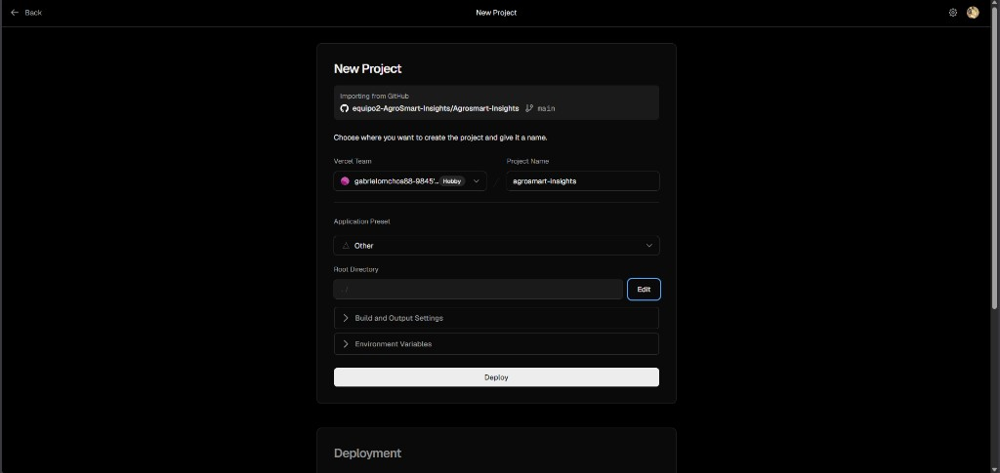
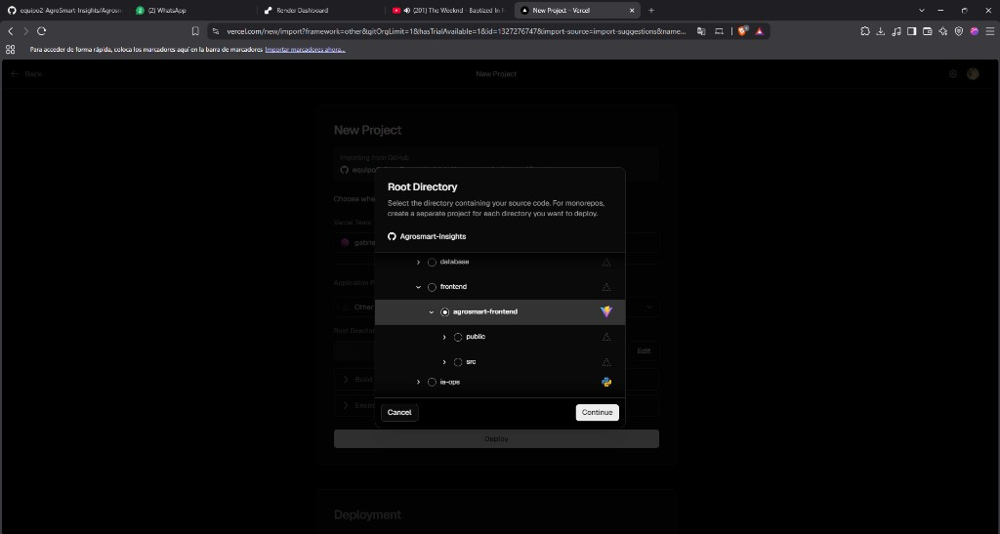

# Informe de Configuración — Despliegue Frontend en Vercel

**Proyecto:** AgroSmart Insights  
**Sprint:** 1  
**Rol:** Líder DevSecOps — Gabriel Emilio León Cangalaya  
**Célula:** 2  
**Historia vinculada:** S1-01 — Desplegar servidor Cloud y pipeline CI/CD (#28)  
**Fecha:** 25 de agosto de 2026  
**Versión:** V.1 (actualizado)

---

## 1. Introducción

AgroSmart Insights separa el despliegue en dos plataformas cloud gratuitas (tier Hobby/Free):

| Plataforma | Qué aloja | Por qué |
|---|---|---|
| **Vercel** | Frontend React (chat NLQ) | Optimizado para sitios estáticos y Vite; CDN global |
| **Render** | n8n + PostgreSQL | Backend de automatización y base de datos |

Este informe documenta la **configuración inicial del frontend en Vercel**, usando el repositorio oficial ya integrado en `main` tras el merge del PR #34.

---

## 2. Objetivo

Importar el proyecto GitHub `equipo2-AgroSmart-Insights/Agrosmart-Insights` en Vercel, apuntando al subdirectorio correcto del frontend (`agrosmart-frontend`), de modo que la aplicación React quede publicada y lista para conectarse al webhook de n8n (Render) mediante la variable `VITE_N8N_WEBHOOK_URL`.

---

## 3. Prerrequisitos

- Cuenta en [vercel.com](https://vercel.com) vinculada a GitHub.
- Repositorio con código en rama `main` (✅ merge PR #34 completado).
- Acceso al equipo `equipo2-AgroSmart-Insights` en GitHub.

> **Nota:** La URL del webhook n8n se configura **después** de desplegar Render. Puedes hacer el primer deploy en Vercel ahora y actualizar la variable cuando tengas la URL de n8n.

---

## 4. Procedimiento

### 4.1. Importar el repositorio desde GitHub

1. Entrar a **Vercel → Add New → Project**.
2. Seleccionar el repositorio **`equipo2-AgroSmart-Insights/Agrosmart-Insights`**.
3. Confirmar que la rama es **`main`**.
4. Dejar el nombre del proyecto, por ejemplo: **`agrosmart-insights`**.

**Figura 1.** Pantalla inicial de importación del proyecto en Vercel.



En esta pantalla Vercel muestra por defecto **Root Directory: `./`** (raíz del repo). Eso es incorrecto para nuestro monorepo: el frontend no está en la raíz.

---

### 4.2. Seleccionar el directorio raíz del frontend

1. Clic en **Edit** junto a *Root Directory*.
2. Navegar: `src` → `frontend` → **`agrosmart-frontend`**.
3. Vercel detecta el framework **Vite** (icono triangular) automáticamente al seleccionar esa carpeta.
4. Clic en **Continue**.

**Figura 2.** Selección del Root Directory `src/frontend/agrosmart-frontend`.



**Ruta final que debe quedar configurada:**

```
src/frontend/agrosmart-frontend
```

---

### 4.3. Build Settings (verificar antes de Deploy)

Vercel lee también `vercel.json` en esa carpeta. Los valores esperados son:

| Campo | Valor |
|---|---|
| Framework Preset | Vite (auto) |
| Build Command | `npm run build` |
| Output Directory | `dist` |
| Install Command | `npm ci` |

No es necesario cambiar nada si Vite fue detectado correctamente.

---

### 4.4. Variable de entorno (obligatoria para el chat)

Antes o después del primer deploy, en **Project → Settings → Environment Variables**:

| Nombre | Valor | Entorno |
|---|---|---|
| `VITE_N8N_WEBHOOK_URL` | `https://<tu-n8n>.onrender.com/webhook/v1/query` | Production (y Preview si quieres probar PRs) |

**Formato del webhook:** el workflow WF2 expone la ruta `v1/query`, por lo que la URL completa termina en `/webhook/v1/query`.

**Contrato que envía el frontend:**

```json
{ "pregunta": "texto del usuario", "session_id": "uuid-generado" }
```

**Respuesta esperada de n8n:**

```json
{ "respuesta": "...", "grafico": { ... } }
```

> Si Render aún no está desplegado, usa temporalmente la URL local `http://localhost:5678/webhook/v1/query` solo para pruebas locales. En producción debe ser la URL pública de Render.

---

### 4.5. Desplegar

1. Clic en **Deploy**.
2. Esperar el build (~1–2 min en plan Hobby).
3. Al terminar, Vercel entrega una URL tipo: `https://agrosmart-insights.vercel.app`.

---

### 4.6. Secrets en GitHub (CD automático — opcional pero recomendado)

Para que GitHub Actions despliegue solo al hacer push a `main`, copiar desde Vercel:

| Secret GitHub | Dónde obtenerlo en Vercel |
|---|---|
| `VERCEL_TOKEN` | Account Settings → Tokens → Create |
| `VERCEL_ORG_ID` | Project Settings → General |
| `VERCEL_PROJECT_ID` | Project Settings → General |
| `VITE_N8N_WEBHOOK_URL` | Misma URL del webhook n8n |
| `FRONTEND_HEALTH_URL` | URL pública del frontend (ej. `https://agrosmart-insights.vercel.app`) |

Lista completa: `docs/sprint-1/SECRETS-GITHUB-SPRINT1.md`.

---

## 5. Verificación

### 5.1. Build exitoso

- En Vercel → **Deployments**, el último deploy debe mostrar estado **Ready**.

### 5.2. Página carga

- Abrir la URL pública → debe verse la interfaz de chat AgroSmart.

### 5.3. Conexión con n8n (cuando Render esté listo)

- Escribir una pregunta en el chat.
- Si `VITE_N8N_WEBHOOK_URL` es correcta, n8n responde con JSON.
- Si falta la variable: error en consola del navegador *"VITE_N8N_WEBHOOK_URL no está configurada"*.

### 5.4. Health check (DevSecOps)

```bash
FRONTEND_URL=https://agrosmart-insights.vercel.app \
./infrastructure/scripts/health-check.sh
```

Debe retornar HTTP 200.

---

## 6. Resultados

| Ítem | Estado |
|---|---|
| Repo importado desde GitHub (`main`) | ✅ |
| Root Directory = `src/frontend/agrosmart-frontend` | ✅ (evidencia Fig. 2) |
| Framework Vite detectado | ✅ |
| Proyecto creado `agrosmart-insights` | ✅ (evidencia Fig. 1) |
| Variable `VITE_N8N_WEBHOOK_URL` | ✅ `https://agrosmart-n8n.onrender.com/webhook/v1/query` |
| Deploy Ready (Congratulations) | ✅ 25/08/2026 |
| Timeout cliente 30 s | ⏳ En PR (`n8nClient.js`); bundle actual = 6 s |
| CD automático vía GitHub Actions | ⏳ Pendiente secrets `VERCEL_*` |

---

## 7. Conclusiones

La configuración en Vercel sigue el diseño del Sprint 1: el frontend React vive en un subdirectorio del monorepo y Vercel debe apuntar explícitamente a `src/frontend/agrosmart-frontend`, no a la raíz `./`. Las capturas confirman que el flujo de importación y selección de directorio se realizó correctamente.

El circuito frontend → backend ya está enlazado. El único refinamiento de código pendiente es el timeout de 30 s del cliente NLQ, para que las respuestas de WF2 no se corten en el plan gratuito de Render.

---

## 8. Referencias

- Vercel. (2026). *Deploying a Git repository*. https://vercel.com/docs/deployments/git  
- Render. (2026). *Blueprint specification*. https://render.com/docs/blueprint-spec  
- Documentación interna: `docs/sprint-1/SETUP-VERCEL-RENDER.md`, `docs/DEPLOY.md`  
- Repositorio: https://github.com/equipo2-AgroSmart-Insights/Agrosmart-Insights

---

**Anexos:** `docs/sprint-1/assets/vercel-01-importar-proyecto.png`, `vercel-02-root-directory.png`, `vercel-03-env-webhook.png`, `vercel-04-deploy-ok.png`, `frontend-timeout-6s.png`.
